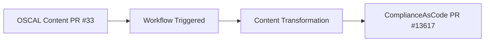
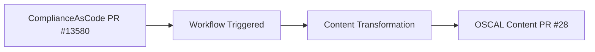
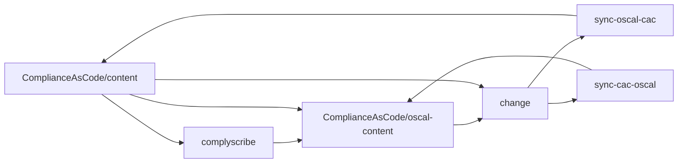
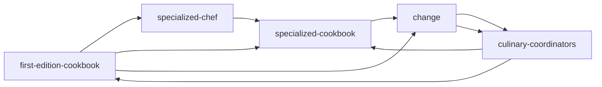

## Step 2: Deep Dive into `ComplianceAsCode/oscal-content` 

_Where OSCAL content initialized by complyscribe is housed_

> After completing _Step 1: Read the docs_, strengthen your understanding by examples and analogies below.

## **Mastering the Recipe: A Compliance-as-Code Analogy 🍮📚**

Let's imagine the relationship between `ComplianceAsCode/oscal-content` and `ComplianceAsCode/content` using a delicious analogy.

### **The First-edition Cookbook: ComplianceAsCode/content**

**Think of `ComplianceAsCode/content` as your definitive, first-edition cookbook for all things compliance.** It contains the foundational, approved recipes (compliance rules, policies, benchmarks) for every aspect of your organization's security posture. This is the **source of truth** for all compliance endeavors.

### **The Specialized Cookbook: ComplianceAsCode/oscal-content**

**Now, imagine ComplianceAsCode/oscal-content as a specialized companion cookbook.** It's built directly from the First-Edition Cookbook but focuses specifically on the "Creme Brûlée" section – representing the OSCAL (Open Security Controls Assessment Language) format.

This specialized book contains only the creme brûlée recipes, ensuring they are always up-to-date with the First-edition Cookbook, even as the original recipes evolve. It's designed for those who need to work exclusively with the OSCAL format, building upon the foundational recipes while maintaining perfect synchronization.

### **The Culinary Coordinators: GitHub Actions & complyscribe 🧑‍🍳✨**

**GitHub Actions are your tireless team of culinary coordinators, and complyscribe is their specialized chef.** Their combined job is to ensure that any improvements or updates to the creme brûlée recipe – whether in the First-edition Cookbook or the Specialized Cookbook – are perfectly synchronized and reflected in both.

**Here's how they work:**

* **First-edition Cookbook Update:** When you refine the creme brûlée recipe in the First-edition Cookbook, your Culinary Coordinators (GitHub Actions) spring into action. They use complyscribe as their expert chef to automatically translate and update the Specialized Cookbook (ComplianceAsCode/oscal-content). This ensures that your friend, who relies on the specialized OSCAL version, always has the latest and greatest recipe.  
* **Specialized Cookbook Discovery:** If your friend discovers a more efficient way to caramelize the sugar (a new OSCAL implementation or refinement), the Culinary Coordinators (GitHub Actions) ensure this valuable insight is shared back and incorporated into the First-edition Cookbook.  
* **Constant Harmony:** This automated synchronization, powered by GitHub Actions and `complyscribe`, means you and your friend are always working from the most refined and complete creme brûlée instructions. GitHub Actions act as the automated bridge, with `complyscribe` handling the crucial conversion process, ensuring consistent, high-quality "compliance creme brûlée" across both repositories.

In essence, GitHub Actions automate the collaboration, and complyscribe facilitates the specific conversion and synchronization, ensuring that the specialized OSCAL content (oscal-content) remains perfectly aligned with the comprehensive compliance content (content), and vice versa, leading to a consistently delicious (and compliant\!) final product.

## Mapping `oscal-content` to `ComplianceAsCode/content` with `complyscribe`

### Bidirectional Synchronization

**Staying updated with content changes:** `sync-oscal-cac` and `sync-cac-oscal` ensure that the _back and forth_ exchange of information is accurate and synchronized. 

#### `sync-oscal-cac` 

Once there is a change made in the `oscal-content` repository, there is an automatic trigger that transforms the `ComplianceAsCode/content` content and proposes changes to that material. 

_Goal: updates should be accurately synchronized immediately upon changes_

Above, the PR in the `oscal-content` will trigger the workflow and make sure the changes are initialized by `complyscribe`. Then, those changes will be sent back and proposed in the `ComplianceAsCode/content` repository.

The updates automatically trigger the request to propose changes to the `ComplianceAsCode/content` repository content. The deletion of rules from the `component-definition.json` trigger the automatic generation of this [PR](https://github.com/ComplianceAsCode/content/pull/13680) in `ComplianceAsCode/content`. The PR proposes changes to the levels applied to the control file [cis_rhel8](https://github.com/ComplianceAsCode/content/pull/13680/files#diff-c97f4c1b44844a9d76570cbbc2bf8fdbceb1dc1076461fc8408870ab612cad9cR33) in `ComplianceAsCode/content`

#### `sync-cac-oscal`

Once there is a change in the `ComplianceAsCode/content` content, there is an automatic trigger that will transform the content handled by `complyscribe`. Then, automatically requesting that the proposed changes be synchronized and updated in the `ComplianceAsCode/oscal-content` repository. 

> I know you're probably wondering why this is important...but, check this out!

Above, the control file defines the RHEL8 HIPAA profile. The change makes it simpler to reference this [hipaa control file](https://github.com/ComplianceAsCode/content/blob/master/controls/hipaa.yml) in the [RHEL8 HIPAA Profile](https://github.com/ComplianceAsCode/content/blob/master/products/rhel8/profiles/hipaa.profile). The rules associated with the controls are now in the control file and referenced in the RHEL8 Profile. The table below outlines the Rule, `ComplianceAsCode/content` representation, and the PDF reference to the requirement that the rule satisfies.

| Rule                            | ComplianceAsCode/content                                                                                                                                                                                                  | PDF Format                                                                                                                                                                                                                                           |
|---------------------------------|---------------------------------------------------------------------------------------------------------------------------------------------------------------------------------------------------------------------------|------------------------------------------------------------------------------------------------------------------------------------------------------------------------------------------------------------------------------------------------------|
| coreos_disable_interactive_boot | [coreos_disable_interactive_boot](https://github.com/ComplianceAsCode/content/blob/213ff61cc3ea47773f478297e95d559fb6a15a6d/linux_os/guide/system/accounts/accounts-physical/coreos_disable_interactive_boot/rule.yml#L4) | [Risk Management 164.308(a)(1)(ii)(B)](https://www.ecfr.gov/current/title-45/part-164/section-164.308#p-164.308(a)(1)(ii)(B))                                                                                                                        |
| disable_ctrlaldel_burstaction   | [disable_ctrlaldel_burstaction](https://github.com/ComplianceAsCode/content/blob/213ff61cc3ea47773f478297e95d559fb6a15a6d/linux_os/guide/system/accounts/accounts-physical/disable_ctrlaltdel_burstaction/rule.yml#L4)    | [Risk Management 164.308(a)(1)(ii)(B)](https://www.ecfr.gov/current/title-45/part-164/section-164.308#p-164.308(a)(1)(ii)(B)), [Risk Management 164.308(a)(7)(i)](https://www.ecfr.gov/current/title-45/part-164/section-164.308#p-164.308(a)(7)(i)) |

The control ids are updated in the OSCAL Content PR #28 triggered by the update in ComplianceAsCode/content. The `oscal-content` profiles for RHEL8/HIPAA - [rhel8-hipaa-required](https://github.com/ComplianceAsCode/oscal-content/blob/1bf63ff5e400f1bd4934007e5251a586cbcafa7a/profiles/rhel8-hipaa-required/profile.json)

### Take notes in a GitHub Issue

Follow the procedure in [issue-help.md](https://github.com/hbraswelrh/creme-brulee/blob/main/docs/issue-help.md) to take notes on the course content. GitHub issues allow for easily keeping track of notes related to the course. 

#### Self-assessment

_Let's see what you've learned_

Take the [self-assessment](https://docs.google.com/forms/d/e/1FAIpQLSfNAhRcdn0J_cFNAvtzfWz8-r41XU0qYmV_OVtWPgXHqUtRPw/viewform?usp=header ) once you have completed Step 2: _Deep Dive into oscal-content_.

## Visual Representation

- **`ComplianceAsCode/content`:** first-edition-cookbook
- **`ComplianceAsCode/oscal-content`:** specialized-cookbook
- **`complyscribe`:** specialized-chef
- **`sync-oscal-cac`** & **`sync-cac-oscal`:** culinary-coordinators

> The original analogy content was _edited_ through prompting by Google Gemini.

Having trouble? 🤷
 

- Reference the complyscribe [`README.md`](https://github.com/complytime/trestle-bot/blob/main/README.md).
- [The guide for navigating public templates](https://docs.github.com/en/repositories/creating-and-managing-repositories/creating-a-repository-from-a-template)
- (replace-me: Additional troubleshooting tips as needed)

