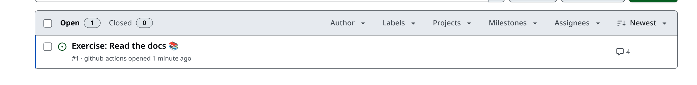
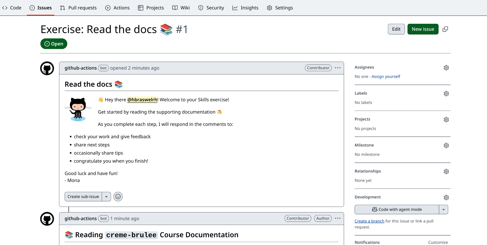

# Bite-sized ComplyTime 🍮

_Learn to use ComplyTime organization projects and tools._

## Welcome

- **Who is this for**: Compliance Managers
- **What you'll learn**: In this course, you'll learn about the ComplyTime organization tools, update OSCAL Content from the GitHub UI using Git flow and markdown, and how to leverage those tools for Compliance Management workflows.
- **What you'll build**: You'll open a GitHub Issue for note-taking, open a pull request for proposed changes in the `markdown/` folder, interact with the ComplyTime organization codebases, and understand how ComplyTime tools assist in managing your Compliance Documentation through Agile Authoring and automated workflows.

### Prerequisites

#### GitHub 

- You'll need a GitHub account with a personal access token, setup [account here](https://docs.github.com/en/get-started/start-your-journey/creating-an-account-on-github), [token here](https://docs.github.com/en/authentication/keeping-your-account-and-data-secure/managing-your-personal-access-tokens) :octocat:
- Account setup should take around 2 hours.

##### OSCAL for Compliance Managers

> Required before attempting the ComplyTime module of the skills discovery

- Review the OSCAL recordings [Why are we here? Intro to OSCAL: for Compliance Managers](https://drive.google.com/file/d/1cGZxjptHl2UKS83nhgYvWXyFdnRtw2uf/view?usp=sharing) and [Intro to OSCAL Tooling](https://drive.google.com/file/d/1hBKTw4mOBFsm60zYFABRc6PJEJwOqgcd/view). The slides can be referenced [here](https://docs.google.com/presentation/d/13LDE-AL3xvWf1trSn_NE1OyjTP1KwVaq3HIbypgvtuU/edit?usp=sharing)
- Review of the OSCAL recordings should take around an hour (30 mins/recording). 

##### Required GitHub curated skills courses to complete prior to the ComplyTime module 

> The required GitHub Skills courses will prepare you to interact with GitHub Issues, Pull Requests, and understand Git Flow. Completion of these exercises should take around 2 hours.

  - Take the [Introduction to GitHub](https://github.com/skills/introduction-to-github) Skills course. 
  - Take the [Communicate using Markdown](https://github.com/skills/communicate-using-markdown) GitHub Skills course. 

**Document your completion of these prerequisites [here](https://docs.google.com/forms/d/e/1FAIpQLScOfS4HjpbhMkbNqPCAUOnTdnZGHFNTQPemmMJkfH1_CH21Lw/viewform?usp=sharing&ouid=104913281648749089640)**

### :vertical_traffic_light: Start Here

  - Review the [GLOSSARY.md](https://github.com/hbraswelrh/creme-brulee/blob/main/docs/GLOSSARY.md) for relevant terms that will be used throughout course content. 
  - Refer to [GEMINI.md](https://github.com/complytime/creme-brulee/blob/main/docs/GEMINI.md) for prompts that could help with understanding the repository contents of [complyscribe](https://github.com/complytime/complyscribe/README.md), [complyctl](https://github.com/complytime/complyctl/README.md), and [ComplianceAsCode/content](https://github.com/ComplianceAsCode/content/blob/master/README.md).  

> :hourglass: **How long?** This exercise is self-paced. The [manual_steps.md](https://github.com/complytime/creme-brulee/blob/main/steps/manual_steps.md#-reading-creme-brulee-course-documentation) can be leveraged to pace yourself, revisit subjects, and follow step-by-step examples. The automated ComplyTime Skills Discovery typically takes about **two hours** to finish. However, the actual time may vary depending on your **reading comprehension** and **level of interest**.

In this exercise, you will:
1. Learn about the relevant repositories in the ComplyTime organization.
2. Practice using Git, Markdown, and ComplyTime tools for getting comfortable with the workflow.
3. Provide feedback on the [ComplyTime Skills Discovery](https://docs.google.com/forms/d/e/1FAIpQLSc3v53F7glwUIFzg8rSXdEgLAONC856yiL0eJYT2kedmm7wKQ/viewform?usp=header). 

### How to start this exercise

Simply copy the exercise to your account, then give your favorite Octocat :octocat: **about 20 seconds** to prepare the first lesson, then **refresh the page**.

Having trouble? 🤷
 

- Review the [manual_steps.md](https://github.com/complytime/creme-brulee/blob/main/steps/manual_steps.md#-reading-creme-brulee-course-documentation) and reach out in the Slack channel [#learn-complytime](https://redhat.enterprise.slack.com/archives/C093B45QGQM)
If the exercise isn't ready in 20 seconds, please check the [Actions](../../actions) tab.

- An issue should be opened that looks like this:

---

&copy; 2025 GitHub &bull; [Code of Conduct](https://www.contributor-covenant.org/version/2/1/code_of_conduct/code_of_conduct.md) &bull; [MIT License](https://gh.io/mit)
