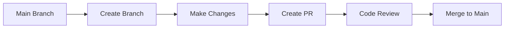

# 🚀 Git: The Need to Know

[](https://github.com/features/actions)
[](https://git-scm.com/)

---

## 🤖 What are GitHub Actions?

> **GitHub Actions** is an automation platform that helps you **build, test, and deploy** your code directly from GitHub. It lets you automate almost any task that happens in your code repository.

---

## 🏗️ Core Components

Understanding GitHub Actions is all about knowing its key building blocks:

### 📋 Component Overview

| Component | Description | Example |
|-----------|-------------|---------|
| **🔄 Workflow** | Your automation "recipe" (YAML file) | `.github/workflows/ci.yml` |
| **⚡ Event** | What triggers your workflow | Push, PR, issue creation, schedule |
| **💼 Job** | Set of steps on a virtual machine | `build`, `test`, `deploy` |
| **📝 Step** | Individual task within a job | Run command, use action |
| **🎯 Action** | Reusable code for common tasks | `checkout`, `setup-node` |
| **🖥️ Runner** | Virtual machine executing the job | Linux, Windows, macOS |

### 🔗 How They Work Together

```yaml
Event → Workflow → Job → Step → Action → Runner
```

---

## 🎯 Quick Summary

> **GitHub Actions** lets you automate tasks in your repository by defining **workflows** that run **jobs** (sets of **steps**) on **runners** when specific **events** occur, often using pre-built **actions**.

---

## 🌿 GitHub Branches & Pull Requests

Think of your project like a collaborative story...

### 📖 The Story Analogy

> 📚 **Main Branch**: Your project's code is like the main story (the main branch)

---

## 🌱 Branches: Your Safe Workspace

**What are branches?**
When you want to work on a new feature or fix something without messing up the main story, you create a **"branch"**.

### 🎯 Key Benefits

| Benefit | Description |
|---------|-------------|
| **🔒 Safe Development** | Work separately without affecting main code |
| **🧪 Experimentation** | Try new ideas without breaking anything |
| **👥 Parallel Work** | Multiple developers can work simultaneously |
| **📊 Feature Isolation** | Each feature gets its own development space |

---

## 🔄 Pull Requests: Sharing Your Work

Once your changes on a branch are finished and ready, you create a **"Pull Request"**.

### 🎯 What Pull Requests Do

| Purpose | Description | Emoji |
|---------|-------------|-------|
| **📢 Announce** | "Hey, I've finished my work!" | 👏 |
| **👀 Show Changes** | Let others see exactly what you've done | 🔍 |
| **💬 Get Feedback** | Have teammates review your changes | 🗣️ |
| **🔗 Request Merge** | Ask to add changes back to main story | ⬆️ |

### 🔄 The Workflow



---

## 📈 The Complete Process

### 🎯 Step-by-Step Guide

1. **🌱 Branch Off**: Create a branch to work safely
2. **⚡ Develop**: Make your changes and improvements
3. **📝 Document**: Write clear commit messages
4. **🔄 Create PR**: Share your work with the team
5. **👥 Review**: Get feedback from teammates
6. **✅ Merge**: Blend changes back into main project

---

<div align="center">

### 🚀 Ready to Master Git?

**Transform your development workflow with Git and GitHub Actions!**

[](https://git-scm.com/doc)
[](https://docs.github.com/en/actions)

</div>

---

> 💡 **Pro Tip**: Think of branches as parallel universes for your code - you can experiment freely, then merge the best changes back to reality!
