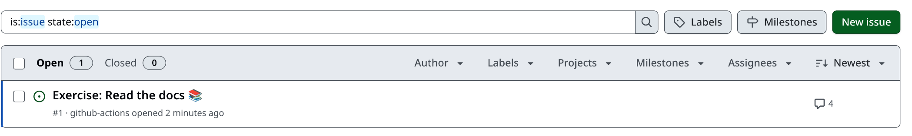
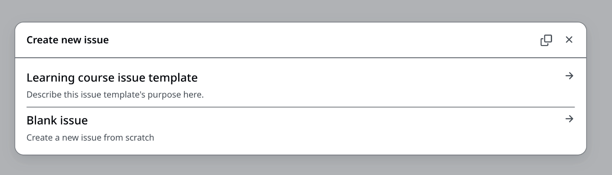
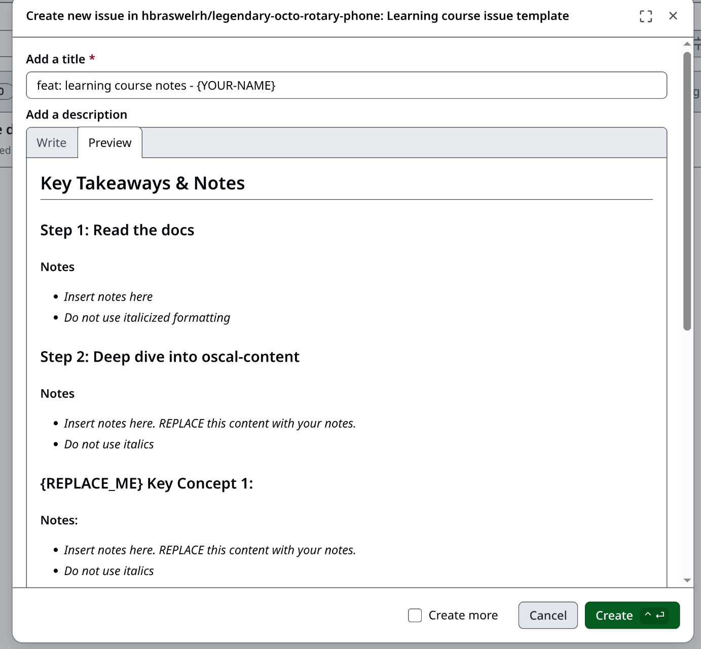
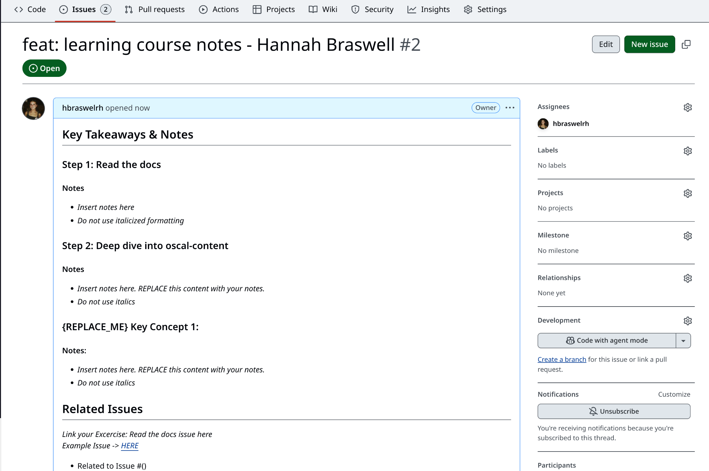
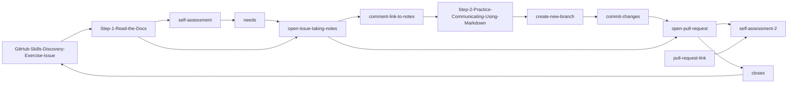

## Creating a new GitHub issue to take notes

**Step 1:** Click "Issues" in your copy of the creme-brulee ComplyTime learning module.

_Similar to Jira issues, GitHub issues are used as a tracking mechanism for progression of work_

 

**Step 2:** Click "New issue" to create a new issue.

**Step 3:** Choose the "Learning Course Issue Template."

**Step 4:** Create a new issue using the template to guide your notes.

_Make changes, edit fields_

**Result:** :tada: New issue created :tada:

