# ComplyTime Manual Steps Guide

  - [📚 Step 1: Reading `creme-brulee` Course Documentation](#-reading-creme-brulee-course-documentation)
      - [✅ Review Materials for Course Completion](#-mandatory-review-materials-for-course-completion)
  - [📓 Taking Notes Using GitHub Issues](#-taking-notes-using-github-issues)
      - [🧭 Navigation Steps](#-navigation-steps)
      - [🔧 Update the Template Content](#-update-the-template-content)
      - [📝 Take the Self-Assessment](#-take-the-self-assessment)
      - [➡️ Next Steps - Trigger Step 2](#-next-steps---trigger-step-2)
  - [🚀 Step 2: Practice Communicating using Markdown and Git](#-step-2-practice-communicating-using-markdown-and-git)
      - [What you'll need](#what-youll-need)
      - [Getting Started](#getting-started)
      - [🌳 Branching Workflow](#-branching-workflow)
      - [📁 Making Changes in the `markdown/` Folder](#-making-changes-in-the-markdown-folder)
      - [🔄 Git Workflow](#-git-workflow)
      - [📝 Providing Context Through Markdown](#-providing-context-through-markdown)
      - [✅ Checking Your Work](#-checking-your-work)
      - [What You'll Submit](https://www.google.com/search?q=%23what-youll-submit)
      - [RHEL10 ANSSI Enhanced Component Definition Example](https://www.google.com/search?q=%23rhel10-anssi-enhanced-component-definition-example)

# ComplyTime GitHub Skills Discovery Manual Steps

> [Prerequisites](https://github.com/complytime/creme-brulee/blob/main/README.md#prerequisites) must be completed prior to attempting the ComplyTime Skills Discovery 

Welcome to the ComplyTime learning course\! This guide will help you navigate the course, which is built on GitHub Skills and uses automated workflows to set up your personalized workspace. You'll use GitHub Issues to keep track of your notes as you progress.

Good luck with your ComplyTime learning journey\!

## **📚 Step 1: Reading `creme-brulee` Course Documentation**

This is the _first_ step of the learning course. Get started by reviewing the docs that will set the stage for your learning journey within the `creme-brulee` project.

### **✅ Mandatory Review Materials for Course Completion**

Ensure you've reviewed these foundational resources for your success in the course.

| Topic                          | Where you can find the docs                                                                             | 
|--------------------------------|---------------------------------------------------------------------------------------------------------|
| ComplianceAsCode/content       | [`docs/CAC-CONTENT.md`](https://github.com/hbraswelrh/creme-brulee/blob/main/docs/CAC-CONTENT.md)       |
| ComplianceAsCode/oscal-content | [`docs/oscal-content.md`](https://github.com/hbraswelrh/creme-brulee/blob/main/docs/oscal-content.md)   |
| complyscribe repository        | [`docs/complyscribe.md`](https://github.com/hbraswelrh/creme-brulee/blob/main/docs/complyscribe.md)     |
| complyctl repository           | [`docs/complyctl.md`](https://github.com/hbraswelrh/creme-brulee/blob/main/docs/complyctl.md)           |
| Policy as Code                 | [`docs/POLICY-AS-CODE.md`](https://github.com/hbraswelrh/creme-brulee/blob/main/docs/POLICY-AS-CODE.md) |
| CNCF                           | [`docs/CNCF.md`](https://github.com/hbraswelrh/creme-brulee/blob/main/docs/CNCF.md)                     |
| Compliance Trestle             | [`TRESTLE-OVERVIEW.md`](https://github.com/hbraswelrh/creme-brulee/blob/main/docs/TRESTLE-OVERVIEW.md)  |

Document your notes in a GitHub issue like [this](https://docs.github.com/en/issues/tracking-your-work-with-issues/configuring-issues/quickstart). Ensure you select "Learning course issue template" when opening your issue.

---

## 📓 **Taking Notes Using GitHub Issues**

> 🎯 **Why this matters:** Taking notes in an issue will help with comfortability using Git and practicing with Markdown. 

As you go through the documentation, it's highly recommended that you take detailed notes. You'll be required to open a GitHub issue for **Step 2:** Deep dive into oscal-content. Your personal workspace, created by the automated workflows, allows you to use GitHub Issues for taking notes. An example issue can be reviewed [here](https://github.com/hbraswelrh/creme-brulee/issues/7). 

Refer to [this example](https://docs.github.com/en/issues/tracking-your-work-with-issues/configuring-issues/quickstart) for additional guidance on how to create an issue.

### 🧭 **Navigation Steps**

> Since you'll be leaving the main exercise page,  open links in a new tab. Make sure you are in `{your_github_username}/{skills_discovery_name}`

#### **Step 1: Access Issues Tab**
Navigate to the Issues tab. Click the green "New issue" box in the top right corner.

#### **Step 2: Select Template**
Open an issue using the "Learning course issue template."

---

### 🔧 **Update the Template Content**

#### **Step 3: Customize Your Issue**
Update the content and the `{REPLACE_ME}` areas with your Key Concepts. Click "Create" to create your issue. This will track your notes while completing Step 1: _Read the docs_.

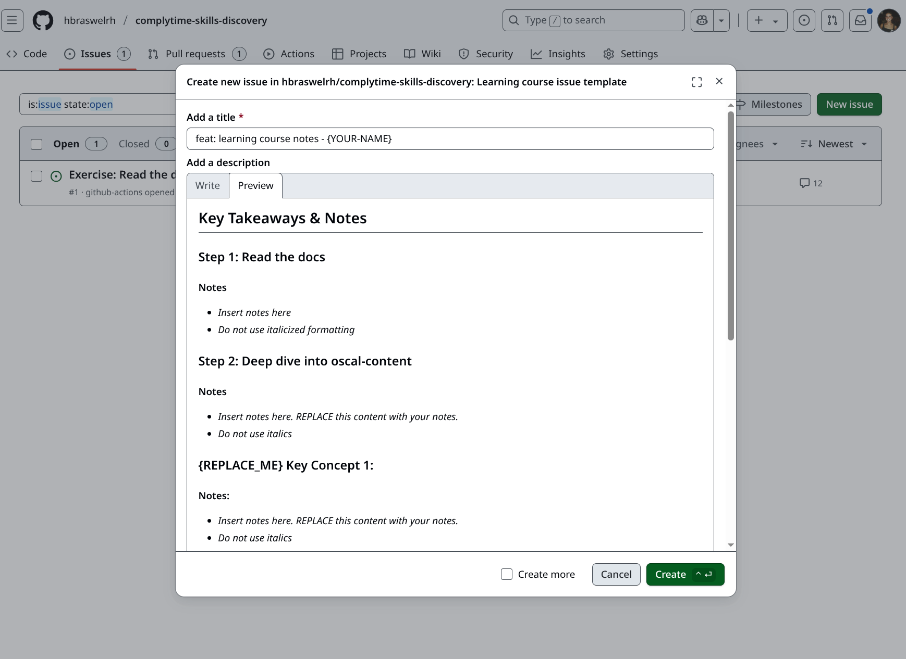

---

---

### **📝 Take the Self-Assessment**

> Copy the link to your notes from Step 1: _Read the docs_ once you have completed the [self-assessment](https://docs.google.com/forms/d/e/1FAIpQLSdE4qJ3pmWa1SaQoWMiUI9p3ZdB947PbhqZEIFo7nWYdcJ44A/viewform). 

---

### ➡️ **Next Steps - Trigger Step 2**

> 🎯 **Action Required:** Once you have taken notes and completed the self-assessment for Step 1: Read the docs, copy the link of your issue and paste it in the comments of your Exercise: Read the docs issue.

**Click "Comment."** That comment will trigger Step 2 to populate in the issue body.

#### 💬 **Comment the Link to Your Notes to Populate Step 2**

> 🔄 **How it works:** Comment the link to your note-taking issue on the exercise issue once finishing Step 1: _Read the Docs_. The next step will populate after around 20 seconds.

After around 20 seconds, the same GitHub Issue titled **Exercise: Read the docs** will populate Step 2: Practice Communicating using Markdown and Git. 

#### Step 2 content

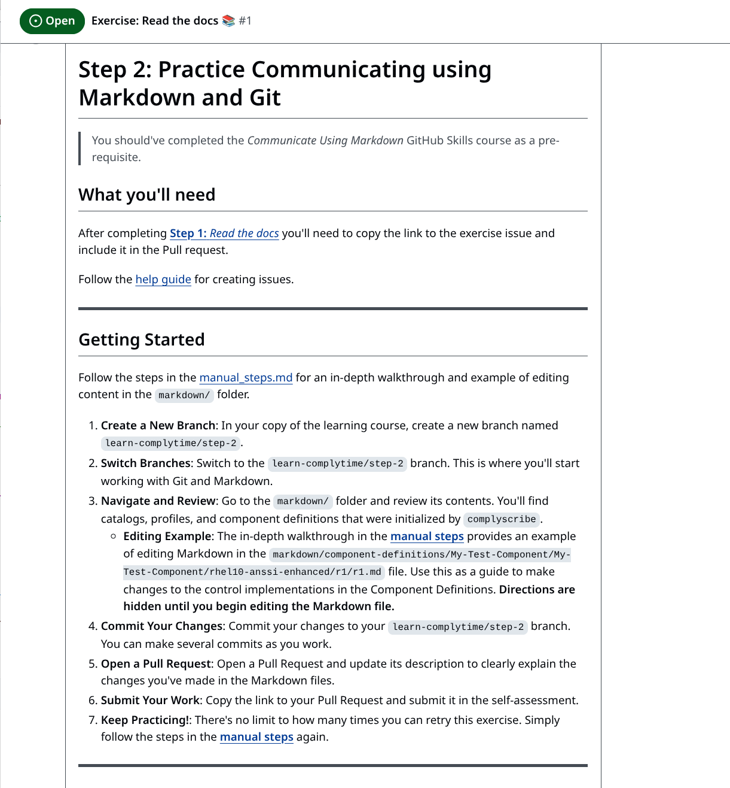
---

## 🚀 **Step 2: Practice Communicating using Markdown and Git**

> You should've completed the _Communicate Using Markdown_ GitHub Skills pre-requisite course.  

## What you'll need

After completing [**Step 1:** _Read the docs_](https://github.com/hbraswelrh/creme-brulee/blob/main/.github/steps/1-step.md), copy the link to the exercise issue. The link will be attached to your Pull Request at the end of Step 2.  

Follow the [help guide](https://github.com/hbraswelrh/creme-brulee/blob/main/docs/issue-help.md) for creating issues.

---

## **Getting Started**

1. **Create a New Branch**: In your copy of the learning course, create a new branch named `learn-complytime/step-2`. 
2. **Switch Branches**: Switch to the `learn-complytime/step-2` branch. This is where you'll start working with Git and Markdown.  
3. **Navigate and Review**: Go to the `markdown/` folder and review its contents. You'll find catalogs, profiles, and component definitions that were initialized by `complyscribe`.  
   * **Editing Example**: The in-depth walkthrough in the [**manual steps**](https://github.com/complytime/creme-brulee/blob/main/steps/manual_steps.md) provides an example of editing Markdown in the `markdown/component-definitions/My-Test-Component/My-Test-Component/rhel10-anssi-enhanced/r1/r1.md` file. Use this as a guide to make changes to the control implementations in the Component Definitions. **Directions are hidden until you begin editing the Markdown file.**  
4. **Commit Your Changes**: Commit your changes to your `learn-complytime/step-2` branch. You can make several commits as you work.  
5. **Open a Pull Request**: Open a Pull Request and update its description to clearly explain the changes you've made in the Markdown files.  
6. **Submit Your Work**: Copy the link to your Pull Request and submit it in the self-assessment.  
7. **Keep Practicing\!**: There's no limit to how many times you can retry this exercise. Simply follow the steps in the [**manual steps**](https://github.com/complytime/creme-brulee/blob/main/steps/manual_steps.md) again. For additional help, refer to the [**course layout**](https://github.com/hbraswelrh/creme-brulee/blob/main/steps/course_layout.md).

---

## 🌳 **Branching Workflow**

### 🏠 **Step 1: Navigate to Homepage**

> **Action:** Navigate back to the homepage to create a new branch.

### 👀 **Step 2: View Branches**

> **Action:** Click "View All Branches." The branch `main` should be the only branch in your workspace.

### ➕ **Step 3: Create New Branch**

> **Action:** Click the green button in the top right corner that says "New Branch."

### 🏷️ **Step 4: Name Your Branch**

> **Critical:** Create a new branch named "`learn-complytime/step-2`"

> ⚠️ **Important:** This step is _crucial_ for the course to work. Ensure you create the branch name exactly as `learn-complytime/step-2`.

Click "Create new branch." The default "Source" will be the main branch. That means that the main branch will be copied to your new `learn-complytime/step-2` branch.

> ✅ **Verify:** Make sure you are now on the `learn-complytime/step-2` branch.

### 🔄 **Branch Transition**

**🔴 BEFORE:** `main` branch

**🟢 AFTER:** `learn-complytime/step-2` branch

---

## 📁 **Making Changes in the `markdown/` Folder**

> 🎯 **Your Task:** You will make edits to content in the Markdown folder.

Navigate to the `markdown` folder. There should be several folders `catalogs`, `profiles`, and `component-definitions`.

### 📂 **Component Definitions Structure**

Clicking on Component Definitions there will be RHEL8, RHEL9, and RHEL10 content initialized by `complyscribe`. The folders are organized by `Example-POLICY-level/compdef-title/profile`. This example uses content for the RHEL10 ANSSI Enhanced Example Component Definition.

### 📄 **Reference: RHEL10 ANSSI Control R1**

> **Reference:** Example Markdown for RHEL10 ANSSI Control R1: Hardware Support.

[Control R1 in PDF format](https://cyber.gouv.fr/sites/default/files/document/linux_configuration-en-v2.pdf)

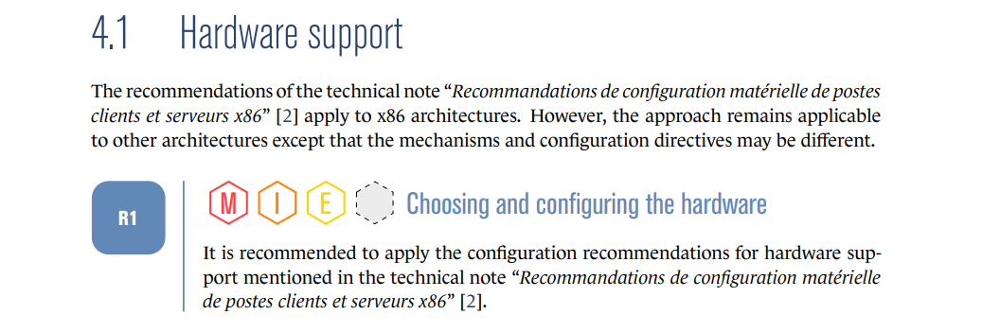

### 📝 **What You'll Edit**

> **Markdown version:** Control R1 from `rhel10-anssi-enhanced` OSCAL Profile.

### ✏️ **How to Edit**

> **Instructions:** Updates can be made to the Component Definition editable content by clicking the pencil in the top right corner of the `r1.md` file. This is where you must make sure that the branch selected in the top left corner is `learn-complytime/step-2`.

> 🧠 **Knowledge Check:** This is the step where your knowledge from the Intro to GitHub Skills and Communicate Using Markdown will be important. The "Edit" and "Preview" tabs in the GitHub UI editor will help you check your Markdown work as you go. "Edit" is the Markdown formatted text. "Preview" is the styled format with Markdown applied.

### 📝 **Editing Interface**

#### ✏️ **EDIT Mode**
> Markdown format that includes my change "Example control implementation description for control r1. This should be edited as part of Step 2 of the ComplyTime GitHub Skills Discovery."

#### 👁️ **PREVIEW Mode**
> Styled Markdown format that includes my change "Example control implementation description for control r1. This should be edited as part of Step 2 of the ComplyTime GitHub Skills Discovery."

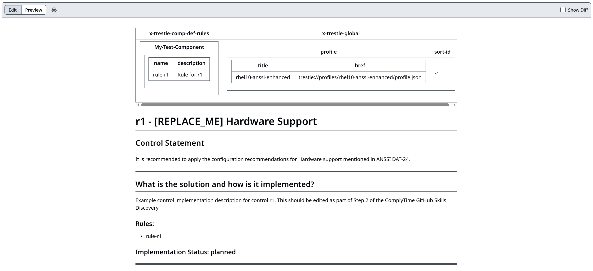

---

## 🔄 **Git Workflow**

After making a few edits click the green button in the top right corner "Commit Changes." There will be a pop-up window that includes a field for your commit message and the extended description. The description can be left blank or expand on the changes you made to the Markdown.

> ⚠️ **Important:** Ensure the "Commit directly to the learn-complytime/step-2 branch" option is selected.

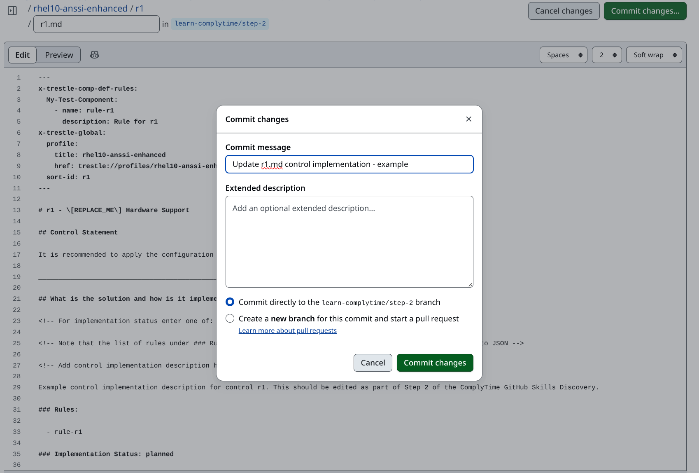

### 📤 **Create Pull Request**

Click the green box that says "Commit Changes." Then, click **Code** in the top left corner to go back to the homepage of your repository. There will be a yellow banner that notifies you that your `learn-complytime/step-2` branch had recent pushes. Click the green box "Compare & pull request."

### 🔍 **Compare Changes**

Once you click "Compare & pull request" there will be a new screen populated to create your pull request. Ensure that the gray banner indicates `base: main` and `compare: learn-complytime/step-2` for the pull request. This will compare your change to R1: Hardware Support that you made on the `learn-complytime/step-2` branch to the `main` branch which was prior to editing the `r1.md` control implementation.

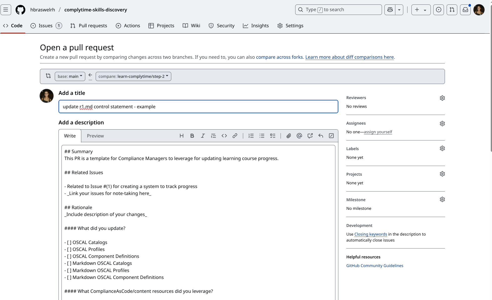

### 📝 **Format Description**

The same rules apply for the Add a description box of the Pull Request. The "Write" tab will show the Markdown format. The "Preview" tab shows the styled Markdown format.

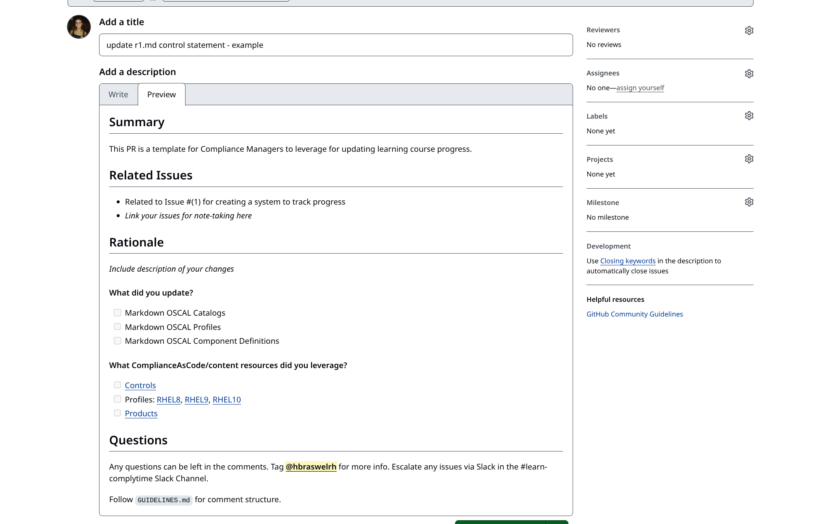

---

## 📝 **Providing Context Through Markdown**

Update the description with the issue that you opened for taking notes on the course content. Easily link the issue by using the `#` symbol. The Pull Request has a template so you can easily use bullet points, check boxes, and link references in Markdown.

Click the green "Create pull request" button. This will create a pull request that proposes changes to the `main` branch. Your commit(s) will be shown in the pull request history.

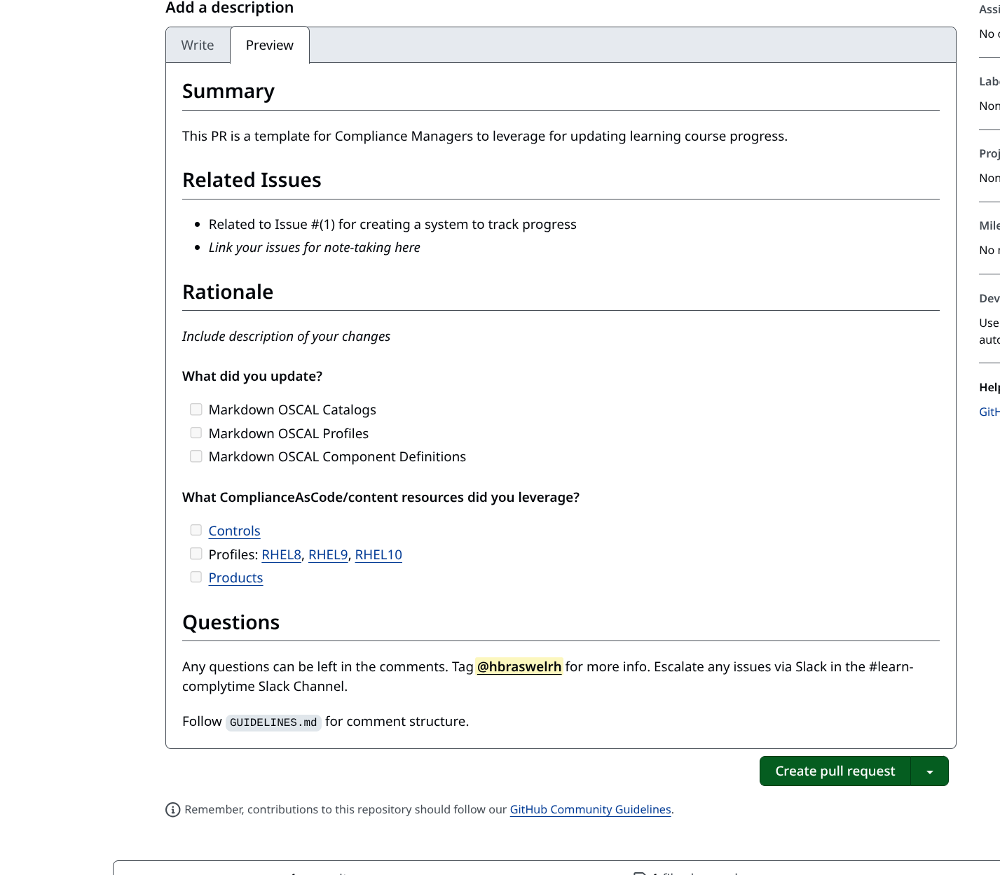

---

## ✅ **Checking Your Work**

### 🎯 **Result**

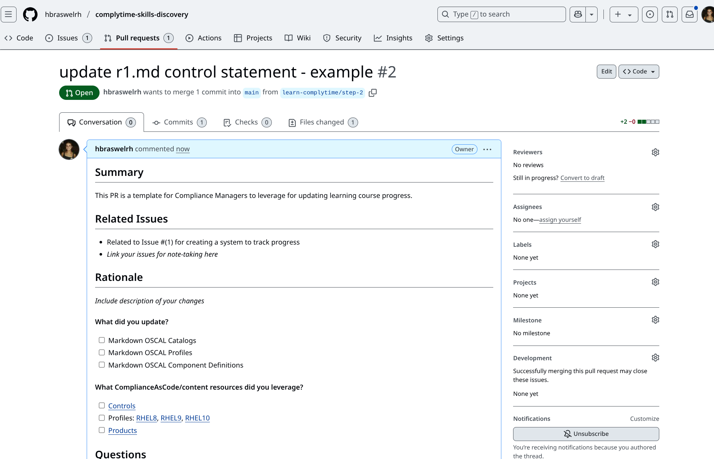

### 📊 **Review Commits**

Click "Commits." The commit message you chose when editing R1: Hardware Support in `r1.md` should match the commit title in your pull request. Clicking on the commit will let you see the changes you made and any description you added.

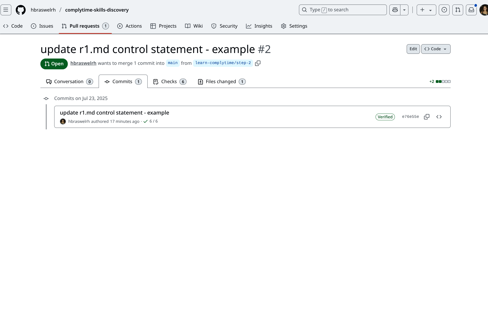

### 👁️ **Commit Preview**

---

## 🎉 **Congratulations!**

Once you have opened the PR your GitHub Issue for the course will **close**. Switching back to the `main` branch, the page will send a Congratulations 🎊 and you can keep practicing or revisit your previous work on the GitHub issue by clicking "RETURN TO EXERCISE."

### 🔄 **Continue Learning**

> **Next Steps:** Clicking "RETURN TO EXERCISE" will bring you back to this page. Feel free to keep practicing.

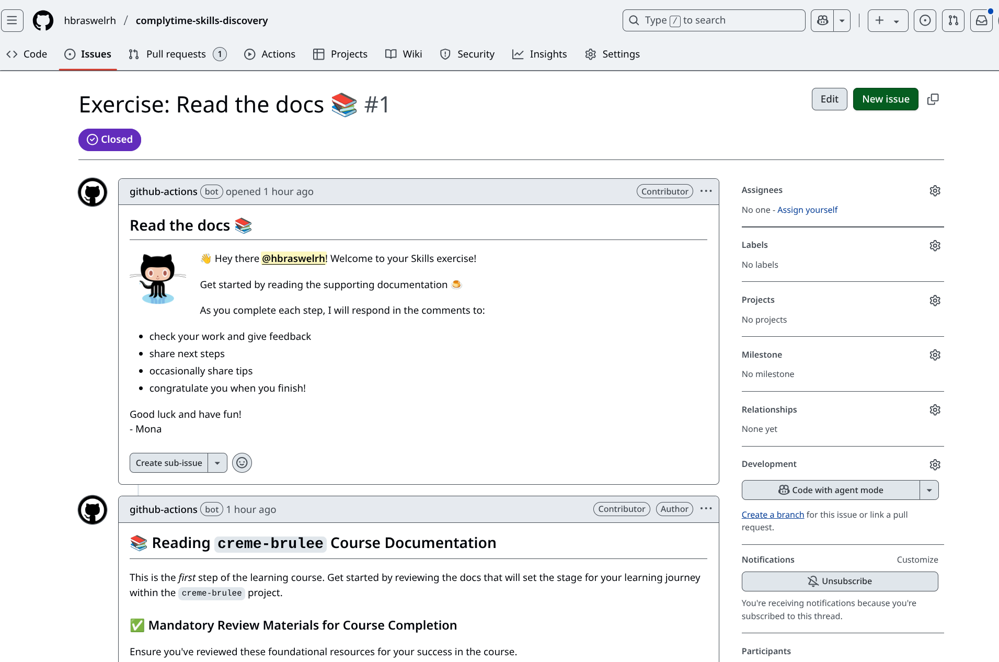

---

## What You'll Submit

The [self-assessment](https://docs.google.com/forms/d/e/1FAIpQLScIXyhvuLdCcKqBewFGggM7I38W7JJ-phbBUIdhJCw0Puz_cg/viewform?usp=header) will require submission of the link to your Pull Request opened for changes to OSCAL Component Definitions. 

Edit a minimum of **three** Component Definitions. Separate each edit by commit. The Pull Request will include all commits published on the `learn-complytime/step-2` branch. When clicking the pencil to edit Markdown files, the hidden instructions will appear.

Copy the link to the exercise issue from [**Step 1:** _Read the docs_](https://github.com/hbraswelrh/creme-brulee/blob/main/.github/steps/1-step.md). The link will be attached to your Pull Request opened during Step 2.  

Follow the [help guide](https://github.com/hbraswelrh/creme-brulee/blob/main/docs/issue-help.md) for creating issues.

## RHEL10 ANSSI Enhanced Component Definition Example

---
x-trestle-comp-def-rules:
  My-Test-Component:
    - name: rule-r1
      description: Rule for r1
x-trestle-global:
  profile:
    title: rhel10-anssi-enhanced
    href: trestle://profiles/rhel10-anssi-enhanced/profile.json
  sort-id: r1
---

# r1 - \[REPLACE_ME\] Hardware Support

## Control Statement

It is recommended to apply the configuration recommendations for Hardware support mentioned in ANSSI DAT-24.

______________________________________________________________________

## What is the solution and how is it implemented?

<!-- For implementation status enter one of: implemented, partial, planned, alternative, not-applicable -->

<!-- Note that the list of rules under ### Rules: is read-only and changes will not be captured after assembly to JSON -->

<!-- Add control implementation description here for control: r1 -->

Making an edit here for the control implementation description for r1.

### Rules:

  - rule-r1

### Implementation Status: planned

______________________________________________________________________

Having trouble? 🤷
 

- Reference the complyscribe [`README.md`](https://github.com/complytime/trestle-bot/blob/main/README.md).
- [The guide for navigating public templates](https://docs.github.com/en/repositories/creating-and-managing-repositories/creating-a-repository-from-a-template)
- Reach out via the #learn-complytime Slack Channel. 

